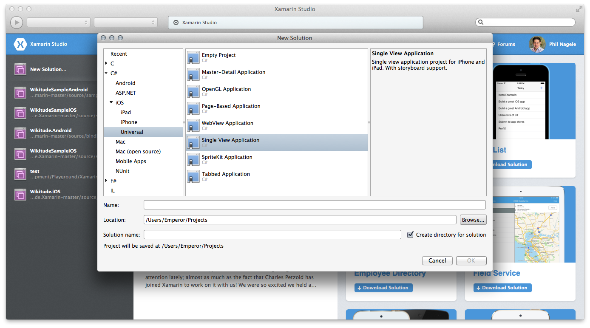
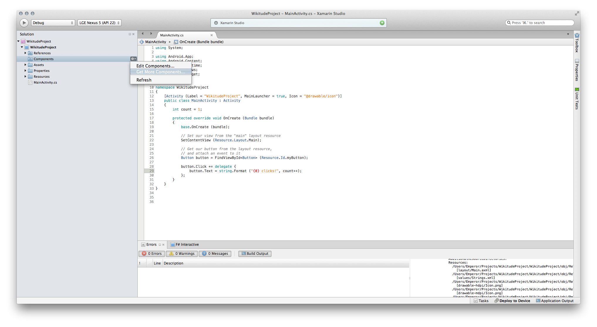
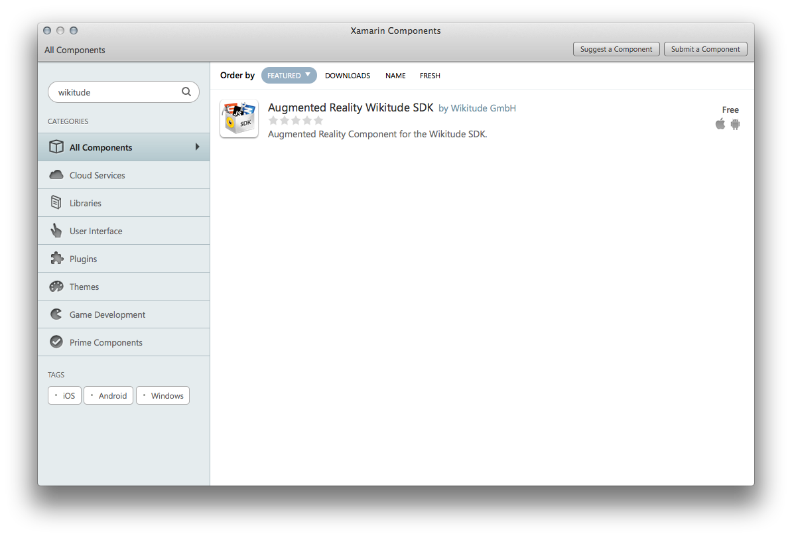

## Setup Guide Xamarin Component

#### Introduction to the Augmented Reality View
From a technical point of view the SDK adds a UI component called **ARchitectView**, similar to a web view. In contrast to a standard web view the AR View can render augmented reality content.

Content developed for the AR View is written in JavaScript and HTML. 

**Note** In this guide we use the terminology `augmented reality experience` and `ARchitect World` synonymously - both of them refer to augmented reality parts of your application. 

### Prerequisites

* Android SDK installed on your development machine (Android development __only__)
* Xcode installed on your development machine (iOS development __only__)
* <a href="http://xamarin.com/download">Xamarin Studio</a> installed and activated with a valid Xamarin license.
* Your personal trial license key from <a href="http://www.wikitude.com/developer/licenses" target="_top">License Page</a>

### Setup and Configuration

The setup chapter includes several guides to setup the Wikitude SDK (through the Wikitude SDK Component). If you want to create an empty app including the component or add it to an existing continue reading. Alternatively you can read about the packaged Sample App and how to use the Wikitude Component.

- [Setup Component for app](#XamarinApp)
- [Using the Wikitude Component](#UsingTheWikitudeComponent)

#### Creating an empty new app 

 
**Note** The guide is based on Xamarin Studio version 5.9.4

1. Open Xamarin Studio and open your existing solution or create a new one.

    

2. Download the Component from the Component Store by right click on `Components`
3. Click `Get More Components`

    

4. In the Xamarin Component Store search for `Wikitude` and click `Add to App`

    

    

5. The Component is now added to your application

5. Add a `using Wikitude.Architect;` in all files where you need to work with the Wikitude Component (e.g. in your iOS view controller or Android activity).

6. Start using the Wikitude Architect View as you would use any other native view in a iOS or Android project. Please refer to our Xamarin example application for a working demo of the Wikitude Component.

7. Add a Architect World to your application resources. Please refer to our [examples](http://www.wikitude.com/external/doc/documentation/latest/xamarin/samples.html#examples) on how to write Architect Worlds.

**Note** Please make sure that your Architect World is correctly added to the final application bundle. Xamarin Studio treats folders outside of the Resources folder a bit odd and you would need to add each file itself to the bundle.

### Using the Wikitude Component

The Wikitude Component includes an example which demonstrates how to setup the ARchitect View and load an AR experience. To get started creating your own AR experience read through the chapters in the [Example section](http://www.wikitude.com/external/doc/documentation/latest/xamarin/samples.html#examples).

##### Loading your augmented reality experience

To load an Architect World simply use the `LoadArchitectWorldFromUrl` method provided by the Wikitude SDK / Xamarin Component. It accepts either an URL pointing to the application bundle or on a remote server and a StartupConfiguration object with which you are able to set certain default values e.g. for the device camera.

On iOS, also the `Start` and `Stop` methods need to be called either when the presented view controller is about to be replaced by another one or the application moves into the background/foreground. Please refer to the example application on how to use both methods and when.

##### Adding communication between Xamarin and ARchitect

In order to communicate with the augmented reality experience from within the Xamarin application the Wikitude SDK offers the `CallJavaScript(string javaScript)` method. The JavaScript will be evaluated in the context of the augmented reality experience. If the augmented reality experience is not fully loaded at the time this function is called, it will be evaluated as soon at the experience is loaded. 

The Wikitude SDK defines a custom URL protocol which can be used to communicate from the ARchitect World to the Xamarin application. You can set a C# method that is called each time a `document.location = architectsdk://` load request is done. Please refer to the iOS/Android documentation or API reference for more information about the platform specific implementation details. 

The Wikitude Component offers more functionality like to inject a custom location or to capture the screen and generate an image that can be shared on Twitter or Facebook. Please also refer to the [platform API documentation and reference](http://www.wikitude.com/external/doc/documentation/latest/xamarin/referencexamarin.html) for more information about the available APIs.

##### Trial and commercial license

By default the Wikitude SDK comes with no valid license key. Read this chapter on how to [obtain a free trial key](http://www.wikitude.com/external/doc/documentation/latest/xamarin/triallicense.html).

Then pass your license key into the SDK using the platform specific API.    

### Further developer resources
* <a href="http://www.wikitude.com/developer/documentation/xamarin" target="_top">Full documentation and additional tutorials</a>
* <a href="http://www.wikitude.com/developer/developer-forum" target="_top">Developer Forum</a>
* <a href="http://www.wikitude.com/download" target="_top">Wikitude SDK Download</a>
* <a href="https://plus.google.com/u/0/103004921345651739447/posts" target="_top">Google+ Page for News</a>
* <a href="http://www.wikitude.com/newsletter" target="_top">Wikitude Newsletter</a>
